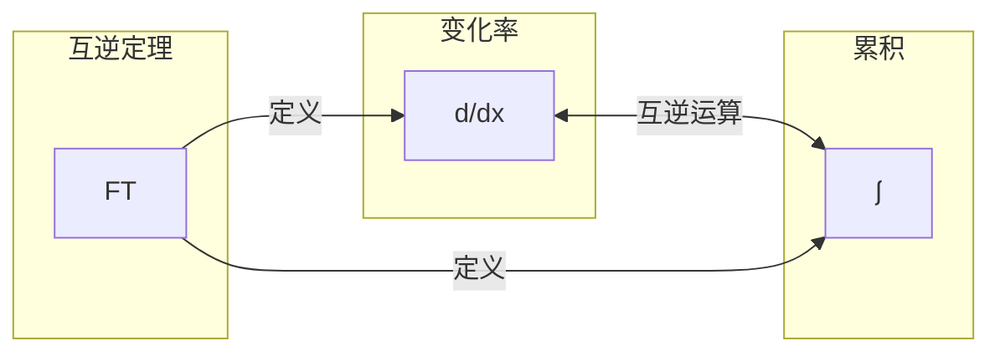
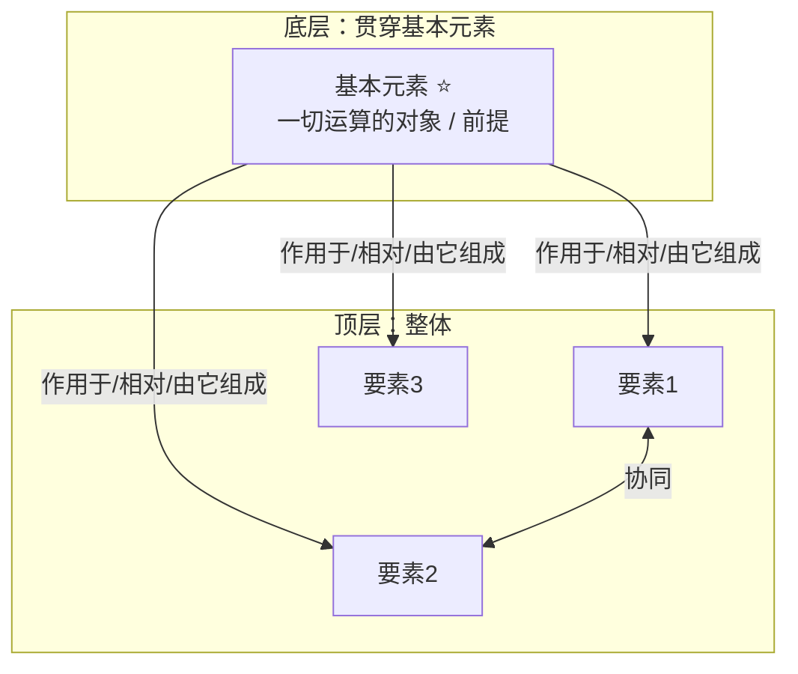

# 学习架构 D v4 — 顶层整体 ＋ 贯穿底层基本元素

> 本文件是 learn-skill 的理论层。所有教学、Wiki 组织、自测都必须遵循。

## 目录
1. [核心思想](#一核心思想)
2. [顶层架构（整体）](#二顶层架构整体)
3. [底层架构（贯穿基本元素）](#三底层架构贯穿基本元素)
4. [连结关系图](#四连结关系图顶层--底层基本元素)
5. [一体知识点单元](#五一体知识点单元)
6. [学习路径](#六学习路径流程)
7. [对 LLM 教学的 11 条要求](#七对-llm-教学的-11-条要求)
8. [质量自查清单](#八质量自查清单)
9. [常见误区与失败模式](#九常见误区与失败模式)
10. [图文并茂输出（四模式并行）](#十图文并茂输出四模式并行)

---

## 一、核心思想

任何系统性知识 = **一个顶层整体** ＋ **贯穿它的底层基本元素**。

| 尺度 | 名称 | 回答的问题 | 定位 |
|---|---|---|---|
| 顶层 | 整体架构 | 这门学问**在说什么 / 是什么** | 核心问题 + 领域公式 + 协同图 |
| 底层 | 贯穿元素 | 整门学问**建立在什么之上** | 一个（或极少数）基本原子 |
| 应用层 | 穿针层 | 这门学问**用来做什么** | 现实问题，把顶层钉在现实上 |

**核心认知**：顶层与底层**本质是同一件事的不同尺度/视角**（v4 的关键转变）。底层不是"另一套平行机制清单"，而是**顶层一切要素共同作用的对象、载体或前提**。

- 微积分顶层是"变化率 / 累积 / 互逆"——全都作用在**函数**上 → 贯穿元素＝函数。
- 牛顿力学顶层是"惯性 / F=ma / 反作用"——全都相对**惯性系**成立 → 贯穿元素＝惯性系。

**学习的本质** = 先立顶层整体 → 找到贯穿其中的基本元素 → 用它将顶层每个角落"钉穿" → 再用现实问题穿针验证。

> **落库要点**：因为顶层与底层是一件事，Wiki 只维护**一页骨架 + 一张连结关系图**，不要拆成两页平行结构。

---

## 二、顶层架构（整体）

由**三件套**构成：

### 2.1 顶层核心问题
定义整个领域要回答的**唯一**根本大问题，是所有知识的生长原点。
- 微积分：数学如何描述"变化"与"累积"？
- 牛顿力学：物体的运动如何被力决定与描述？
- Python：如何将现实问题转化为计算机可执行的指令？

### 2.2 顶层领域公式（符号化整体）
`领域 ≝ ⟨要素1, 要素2, 要素3, …⟩`，用箭头标协同：
- `→` 数据/控制流传递
- `⇄` 互逆运算
- `↔` 等价并行

例：`微积分 ≝ ⟨ 变化率(d/dx), 累积(∫), 互逆(FT) ⟩`，且 `d/dx ⇄ ∫`。

> **粒度规则（本 skill 增加）**：顶层要素个数取 **3 ± 1**。超过 4 个就下沉为"子要素"，避免领域公式退化成清单。

### 2.3 顶层协同图（Mermaid，必须）
用 `subgraph` 分层展示要素的抽象层级与协同（数据流 / 控制流 / 互逆）。



---

## 三、底层架构（贯穿基本元素）

### 3.1 定义
**贯穿基本元素（地基）** = 顶层所有要素**共同作用的对象、载体或前提**——一个（或极少数）贯穿顶层每个角落的原子单位。

### 3.2 判定标准
1. **删掉它，顶层每个要素都失去意义**（它是一切前提）。
2. 顶层每件事，都在"**对谁 / 在什么背景上**"发生？答出来的就是它。
3. 它必须**贯穿全部要素**，而不是只服务某一条。

### 3.3 三形态

| 形态 | 含义 | 例 |
|---|---|---|
| **对象型** | 顶层所有运算都作用在它身上 | 微积分 → 函数 |
| **背景型** | 顶层所有定律都相对它成立 | 牛顿力学 → 惯性系 |
| **原料型** | 顶层所有构造都由它组成 | Python → 对象/值 |

> **本 skill 放宽（重要）**：允许 **主元素 + ≤1 个次元素**。若一个学科确实需要两个原子（如化学：电子 + 键），就登记为 `地基 = {主: 电子, 次: 化学键}`，但**必须通过下面的贯穿度自检表**。

### 3.4 贯穿度自检表（本 skill 增加，必做）

| 顶层要素 | 是否作用在 / 相对【主元素】 | 是否涉及【次元素】 | 该要素与地基的关系 |
|---|---|---|---|
| 要素1 | ✅ | – | 对其实施 X 运算 |
| 要素2 | ✅ | ✅ | 相对它成立 |
| 要素3 | ✅ | – | 由它组成 |
| … | 全部打勾才通过 | | |

**只要有一个要素与地基无关 → 地基没找对**，换一个能覆盖全部的。

### 3.5 地基自身构成图（可选附图）
地基虽是一个基本元素，但可给它一张"它自身如何构成"的附图。它**不平行于顶层**，而是骨架页里的**地基说明图**。

---

## 四、连结关系图（顶层 ⇄ 底层基本元素）

**连结关系图** = 把顶层每个要素"坐"在地基元素之上，用**支撑线**标出"该要素是对基本元素的什么运算 / 关系 / 前提"。这是本架构**唯一**的核心图。

**画法规则**
- 地基元素放**底部**，顶层整体放**上部**；
- 每个顶层要素拉一条支撑线到地基；
- 每条线标注关系（**作用于它 / 相对它成立 / 由它组成**）；
- **双向标注全局一次**（写在骨架页，不必每个单元重复）：
  - 从底看顶：地基是哪些要素的**共同对象/前提**。
  - 从顶看底：顶层每个要素都是**对地基的什么运算/关系**。



例（微积分 · 函数）：

```mermaid
flowchart TB
    subgraph BOT["底层：贯穿基本元素"]
        F[函数 f(x) ⭐<br/>一切运算的对象]
    end
    subgraph TOP["顶层：微积分整体"]
        T1[变化率 d/dx]
        T2[累积 ∫]
        T3[互逆定理 FT]
    end
    F -->|对其求变化率| T1
    F -->|对其求累积| T2
    F -->|在其上互逆| T3
    T1 <-->|互逆| T2
```

---

## 五、一体知识点单元

每个知识点 = 一个"**在地基元素上生长的操作 / 关系**"。以「问题 → 符号 → 知识点」组织：

- **问题**：现实或概念上的疑问（答案有意义）。
- **符号**：核心符号 / 公式（须渲染成图，见 workflows 渲染规范）。
- **知识点（一体）**：
  - **语义解释**：这个要素在顶层"在说什么"。
  - **机制解释（站在地基上）**：它如何作用 / 依赖底层基本元素。**必填**。
  - **定位（连结）**：它在连结关系图的哪个位置——对地基的什么运算。
  - **协同演示**：符号链演示与其他要素的协同。
  - **双向标注**：从底看顶 / 从顶看底（复杂单元才写，简单单元省略）。
  - **应用钉子**：1 个现实问题，标顶坐标。

**两档**（写入 Wiki 时）：最小档 = 符号 / 语义 / 机制 / 定位；完整档 = 再加 协同演示 / 双向标注 / 应用钉子。模板见 [unit-template.md](unit-template.md)。

---

## 六、学习路径（流程）

1. **第 0 遍（整体骨架）**：立顶层核心问题 + 领域公式 + 协同图。
2. **第 0.5 遍（找地基）**：问"顶层每件事都作用在谁身上？"锁定贯穿元素 + 过贯穿度自检。
3. **第 1 遍（沿地基爬升）**：以地基为地基，沿连结图逐条攻破每个顶层要素。**产出 = 每个要素 1 个节点页 + ≥1 个一体单元**。
4. **第 2 遍（从顶下山自测）**：合上图，只看顶层公式，自己重推每要素如何作用在地基上。**推不出 = 真缺口**，记入缺口账本。
5. **应用穿针（贯穿）**：每学完一个要素，用 2–3 个现实题钉住（顶坐标 + 底坐标）。

---

## 七、对 LLM 教学的 11 条要求

1. **顶层整体先行**：先给**唯一核心问题**，再给领域公式（含协同箭头）与协同图。
2. **锁定贯穿基本元素**：明确地基元素，说明它为何是贯穿一切的地基，并给贯穿度自检表。
3. **必出连结关系图**：顶层整体 + 地基元素的图，支撑线标注关系，并做双向标注。
4. **在地基上教学**：讲任何要素时，先说清它"如何作用在地基元素上"（机制），再说它在顶层"在说什么"（语义），二者合并讲，不拆章。
5. **一体知识点单元**：每个新概念以「问题 → 符号 → 一体知识点」输出（两档见第五节）。
6. **协同链演示**：每单元结束用一条完整符号链演示核心公式协同。
7. **单一理论核心**：整个领域只维护**一个顶层根**与**一个地基元素**，禁止平行核心。
8. **符号化优先**：优先用公式、箭头、表格，文字为辅。
9. **应用穿针**：每个主要概念配 2–3 个现实问题，标顶坐标与底坐标。
10. **鼓励重绘连结图**：教学结束，鼓励学习者重绘"顶层整体 + 地基元素"的连结关系图。
11. **图文并茂输出**：资料含图时按四模式并行输出（见第十节）。

---

## 八、质量自查清单（学完一学科逐条打勾）

**顶层整体**
- [ ] 有唯一核心问题、一个领域公式（含协同箭头）、一张协同图
- [ ] 顶层要素 3±1 个，要素间能说出协同（方向 / 互逆 / 等价）

**贯穿地基**
- [ ] 找到一个（或主+≤1 次）贯穿元素，能说出"删掉它顶层会怎样"
- [ ] 通过**贯穿度自检表**：全部要素命中
- [ ] 能说出它是对象型 / 背景型 / 原料型

**连结关系图**
- [ ] 有一张顶层 + 地基的图，每个顶层要素都拉了支撑线
- [ ] 每条线标了"作用于 / 相对 / 由它组成"，且有双向标注

**学习闭环**
- [ ] 走完 第0 → 0.5 → 1 → 2 遍
- [ ] 第 2 遍推不出的真缺口已进缺口账本并补强
- [ ] 每个要素页都挂到地基上，无"悬空砖块"

---

## 九、常见误区与失败模式

| 误区 | 表现 | 修正 |
|---|---|---|
| **把底层当另一套架构** | 底层列一堆平行机制，而非一个贯穿元素 | 压缩为"贯穿顶层的基本元素" |
| **找不到贯穿元素** | 说不出"顶层每件事作用在谁身上" | 问"删掉它顶层是否全失效" |
| **元素没有贯穿** | 找到的元素只服务某一要素 | 换成贯穿全部要素的那个（用自检表） |
| **只有顶层没有底层** | 能复述概念，说不出它的对象/前提 | 先锁地基，再讲每要素如何作用其上 |
| **砖块悬空** | 知识点没挂到地基上 | 每个要素都标注"对地基的什么运算" |
| **把课后习题当钉子** | 题目只考背/算，不连现实 | 换"答案有意义"的现实问题 |
| **平行多个根** | 维护多个互不相干的顶层根 | 合并为一个根 + 一个地基元素 |
| **顶层要素爆炸** | 领域公式列了 8 个要素 | 收敛到 3±1，其余下沉为子要素 |
| **顶层底层做成两页** | 骨架拆成两张平行图 | 合成一页 + 一张连结关系图 |

---

## 十、图文并茂输出（四模式并行）

资料中含架构图 / 流程图 / 示意图等难以用纯文字精准传达的视觉信息时，四种模式并行输出：

1. **分层文字描述**：结构化说明图的组成元素、结构关系、数据流/控制流，不看图也能理解。
2. **可渲染的图表代码**：同步生成 Mermaid / PlantUML 代码块（必要时用 math-skill 渲染成 PNG）。
3. **关键洞察提炼**：单独列出图中最核心的设计思想、约束或创新点。
4. **原图定位指引**：给出原书图号 / 章节位置，说明纯文本难以完整复现，建议对照原图，并概括其不可替代的视觉信息。
