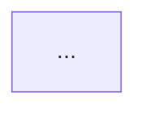
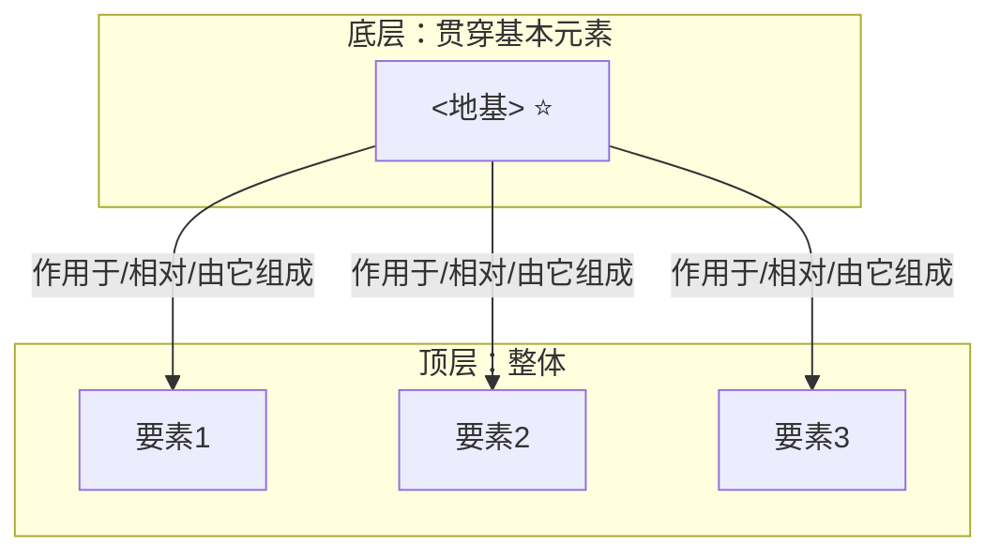

# Wiki 目录结构与页面模板（D v4）

> learn-skill 的持久化结构。**一个知识点 = 一个文件夹**（`index.md` + `img/`），图片跟知识点走。
> 链接规则与资料源模式继承 llm-wiki-skill；图片规范见 [media.md](media.md)。

## 目录结构

```
<项目>/                          # 项目根（若含 .obsidian/ 则 Wiki 放仓库内）
├── raw/
│   ├── 源文件清单.md             # 资料登记（本地=存档副本；IMA=仅登记）
│   └── images/                  # 输入原图（截图/拍照/书本图）— 只读存档
├── media/<slug>.md              # 图片的图文卡（OCR/描述/洞察）— 可 grep
├── index.md                     # 总入口
├── log.md                       # 操作日志（仅追加）
├── WIKI-SCHEMA.md               # 模式与约定
└── wiki/
    ├── 00-骨架/                  # 知识点＝文件夹：骨架页 + 它的图
    │   ├── index.md
    │   └── img/
    ├── 01-问题索引.md             # 索引/账本不是知识点，保持单文件
    ├── 02-缺口账本.md
    ├── 索引-<分类>.md
    ├── <分类>/
    │   └── <要素>/               # 每个顶层要素 = 一个文件夹
    │       ├── index.md          # 要素页（含若干一体单元）
    │       └── img/              # 该知识点的生成图（公式/函数图）
    └── 应用/钉子表.md
```

## 链接路径速查

| 当前文件 | 根 index | 骨架 | 问题索引 | raw/images | media | 本页图 |
|---|---|---|---|---|---|---|
| `wiki/<分类>/<要素>/index.md` | `../../../index.md` | `../../00-骨架/index.md` | `../../01-问题索引.md` | `../../../raw/images/x.png` | `../../../media/x.md` | `./img/x.png` |
| `wiki/00-骨架/index.md` | `../../index.md` | – | `../01-问题索引.md` | `../../raw/images/x.png` | `../../media/x.md` | `./img/x.png` |
| `wiki/索引-<分类>.md` | `../index.md` | `./00-骨架/index.md` | `./01-问题索引.md` | `../raw/images/x.png` | `../media/x.md` | – |
| `media/<slug>.md` | `../index.md` | `../wiki/00-骨架/index.md` | `../wiki/01-问题索引.md` | `../raw/images/x.png` | – | – |

- 用标准 Markdown 相对路径 `[文本](./目标.md)`，**禁用裸 `[[wikilink]]`**。
- **导航栏**（每个页面标题后必备）：
  `> **导航**: [← 返回总纲](../../../index.md) | [骨架](../../00-骨架/index.md) | [问题索引](../../01-问题索引.md)`
- **双向链接**：A→B 则 B 必须有返回 A 的链接。
- **锚点**：`[文本](./页面.md#章节)`，锚点 = 小写标题、空格转连字符。
- **图片**：每张嵌入图必带图注与来源；有图文卡的加链接。

## 骨架页模板：wiki/00-骨架/index.md

````markdown
---
title: 骨架：<领域名>
type: skeleton
created: YYYY-MM-DD
updated: YYYY-MM-DD
core: <领域名 ≝ ⟨要素1, 要素2, 要素3⟩>
base_element: <地基元素>
base_kind: object | background | material
tags: [骨架, 顶层核心问题, 地基元素]
---

# <领域名> — 骨架（顶层整体 ＋ 贯穿地基）

> **导航**: [← 返回总纲](../../index.md) | [问题索引](../01-问题索引.md) | [缺口账本](../02-缺口账本.md)

## 一、顶层核心问题
**<该领域要回答的根本大问题>**

## 二、顶层领域公式
**<领域名> ≝ ⟨要素1, 要素2, 要素3⟩**，且 <协同箭头>

- 要素1（<符号>）：…  

## 三、顶层协同图


## 四、地基元素（贯穿基本元素）
- **地基**：<原子>（对象型 / 背景型 / 原料型）
- **判定**：删掉它，顶层每个要素都会 <…>。
- **贯穿度自检**：

  | 顶层要素 | 作用于/相对主元素 | 关系 |
  |---|---|---|
  | 要素1 | ✅ | … |

## 五、连结关系图（顶层 ⇄ 地基）

**双向标注**：底→顶 …；顶→底 …

## 相关页面
- [← 返回总纲](../../index.md)
- [问题索引](../01-问题索引.md)
- [<要素1>页](../<分类>/<要素1>/index.md)
````

## 要素页模板：wiki/<分类>/<要素>/index.md

````markdown
---
title: <要素名>
type: node
created: YYYY-MM-DD
updated: YYYY-MM-DD
node: <挂载的顶层要素>
base_element: <地基元素>
sources: [源文件名]
images: [img/x.png]
tags: [...]
---

# <要素名>

> **导航**: [← 返回总纲](../../../index.md) | [骨架](../../00-骨架/index.md) | [问题索引](../../01-问题索引.md)

**挂载位置**：骨架 ⟨…⟩ 的 **[要素X]**；**对地基 `<地基>` 的** <什么运算/关系>。

## Q1：<具体问题>
- **符号**：…
  　·　来源：<…>
- **语义**：…
- **机制**：它如何作用在【<地基>】上 …
- **定位**：…

## Q2：…

## 相关页面
- [← 返回总纲](../../../index.md)
- [骨架](../../00-骨架/index.md)
- [<相邻要素>](../<相邻>/index.md)
````

## 问题索引：wiki/01-问题索引.md

```markdown
# 问题索引 — <领域名>

> **导航**: [← 返回总纲](../index.md) | [骨架](./00-骨架/index.md)

从根到叶排列。复习时**只看问题不看答案**。

| # | 问题 | 答案位置 | 状态 | 复习记录 |
|---|------|----------|------|----------|
| 1 | <顶层核心问题> | [骨架](./00-骨架/index.md) | [ ] | |
| 2 | <机制型问题> | [要素页](./<分类>/<要素>/index.md#q1) | [ ] | |

**图例**：`[ ]` 待掌握 · `[x]` 已掌握
**复习节拍**：掌握后按 1 / 3 / 7 / 30 天复查。
```

## 缺口账本：wiki/02-缺口账本.md

```markdown
# 缺口账本 — <领域名>

| # | 缺口（推不出的地方） | 关联要素/地基 | 状态 | 补强动作 | 日期 |
|---|----------------------|---------------|------|----------|------|
| | | | | | |
```

## 钉子表：wiki/应用/钉子表.md

```markdown
# 钉子表 — <领域名>

| 现实问题 | 顶坐标（要素） | 底坐标（地基） | 为何答案有意义 |
|---|---|---|---|
| | | | |
```

## 规模规则

- 内容页 **< 20 页**：`index.md` 用扁平树状大纲。
- **≥ 20 页**：`index.md` 只列分类标题，链接到 `wiki/索引-<分类>.md`，顶部加"快速检索"关键词表。

## 图片规则（摘要）

- 输入原图 → `raw/images/` + `media/<slug>.md` 图文卡；生成图 → 该知识点 `img/`。
- **每张输入图必须有文字层图文卡**，否则图片不可检索。
- 详见 [media.md](media.md)。
