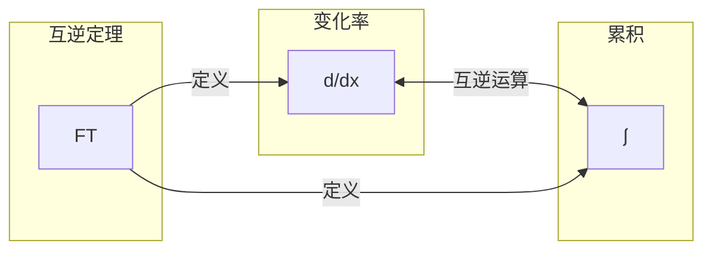

# 学习架构 A — 通用系统知识学习框架

> 本文件是 learn-wiki-skill 的核心理论层。所有教学与 Wiki 组织必须遵循本架构。

## 核心思想

任何系统性知识都可以被提炼为一个极简的**符号化架构**：定义领域核心要素，并揭示它们之间的**动态协同关系**。学习的本质 = 掌握这个核心架构，并把所有知识点"挂载"到架构的节点或连接线上。

## 一、顶层核心问题

定义整个领域所要回答的一个根本性大问题，是所有知识生长的原点。

- 例（计算机科学）：计算机到底是怎么工作的？
- 例（微积分）：数学如何描述"变化"和"累积"？

## 二、核心符号 / 架构（领域公式）

用一个极简公式概括整个领域的本质，必须包含两个要素：

- **核心要素**：组成领域的几个最根本的构件。
- **协同关系**：要素之间如何相互作用、传递信息、形成闭环。

公式通用格式：`领域名称 ≝ ⟨要素1, 要素2, 要素3, …⟩`，并用箭头明确标注协同关系：

- `→` 数据/控制流传递方向
- `⇄` 互逆运算 / 双向协同
- `↔` 等价或并行协同

例：`微积分 ≝ ⟨d/dx（变化率）, ∫（累积）, FT（互逆定理）⟩`，且 `d/dx ⇄ ∫`。

## 三、分层协同架构图（Mermaid，必须输出）

**在输出领域公式时，必须同步生成一个 Mermaid 分层协同架构图。** 要求：

- 用 `subgraph` 分层清晰展示各要素的抽象层级
- 用箭头明确标注数据流 / 控制流 / 互逆关系
- 该图与公式一起构成所有回答的根

## 四、三元组学习单元

所有知识点的组织必须采用「问题 → 符号 → 知识点」三元组：

1. **问题**：一个具体、直观的疑惑（为什么？是什么？怎么描述？）。
2. **符号/架构**：对该问题的精确数学或逻辑表达（公式、符号、代码、参数、规则）。
3. **知识点**，包含三部分：
   - **解释**：符号的含义，为什么能回答问题。
   - **定位**：明确挂载在核心公式的哪个节点/哪条协同线上。
   - **协同演示**：用简短的符号链演示如何与其他要素协同，完成完整功能。

## 五、学习路径（从根到叶）

1. **全局协同观**：先理解核心公式——几个要素、如何协同形成闭环。
2. **主干深入**：沿协同路径逐个深入每个核心要素，掌握核心概念与原理。
3. **叶子挂载**：掌握主干后，再细枝末节的知识点挂载到对应节点/协同线上。
4. **避免孤立学习**：每个新概念都必须明确其在协同路径中的位置。

## 六、对 LLM 教学的要求（完整提示词）

LLM 使用本架构教学时，必须严格遵守：

1. **公式先行，图示并列**：从顶层核心问题出发，立刻给出领域公式，**必须**输出 Mermaid 分层协同架构图。
2. **三元组教学**：每个新概念以「问题 → 符号 → 知识点」输出，知识点含「定位」与「协同演示」。
3. **协同链演示**：每完成一个知识单元，用一条完整符号链回顾其参与核心公式协同的过程。
4. **保持单一理论核心**：只维护核心公式这一个知识树根，所有应用案例/工具/扩展都作为叶子挂载，禁止引入平行核心。
5. **符号化优先**：解释关系/流程/结构时，优先用公式、箭头图、表格，文字描述为辅。
6. **从根到叶，从协同到细节**：先整体协同，再内部细节；未建立全局图景前不跳入零散知识点。
7. **鼓励协同知识图**：每次教学结束，鼓励学习者绘制带箭头和节点标记的协同知识图，并重新标注核心公式。

## 七、图文并茂输出要求（书本图表转译）

当资料含架构图/流程图/示意图等难以用纯文字传达的视觉信息时：

1. **分层文字描述**：结构化说明图的组成元素、结构关系、数据流/控制流，不看图也能理解。
2. **可渲染图表代码**：生成 Mermaid、PlantUML 等代码块，方便直接渲染。
3. **关键洞察提炼**：单独列出图中最核心的设计思想/约束/创新点。
4. **原图定位指引**：给出原书图号/章节位置，说明纯文本难以复现，建议对照原图。
